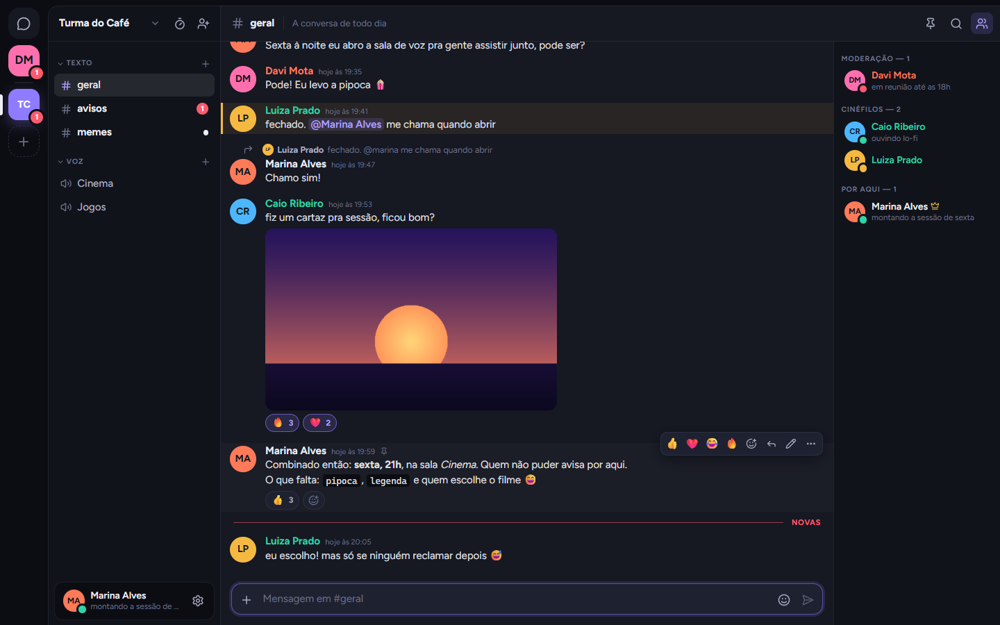
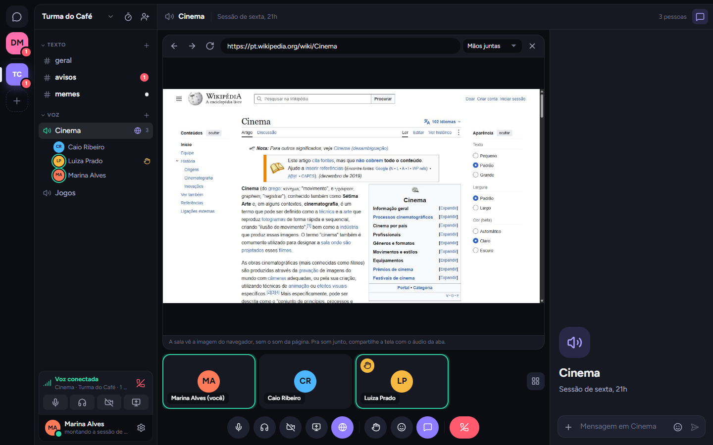
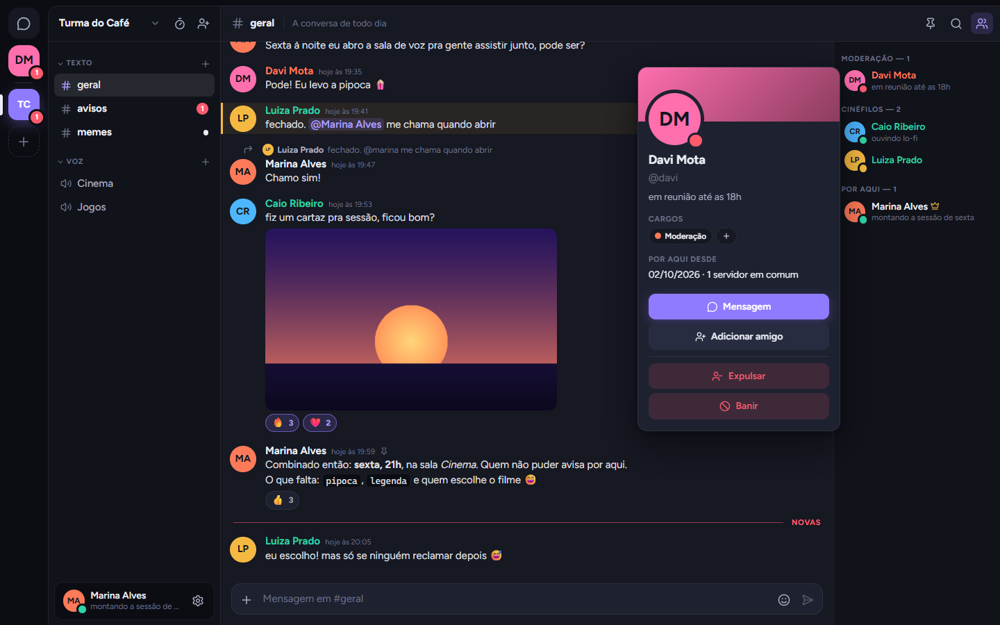
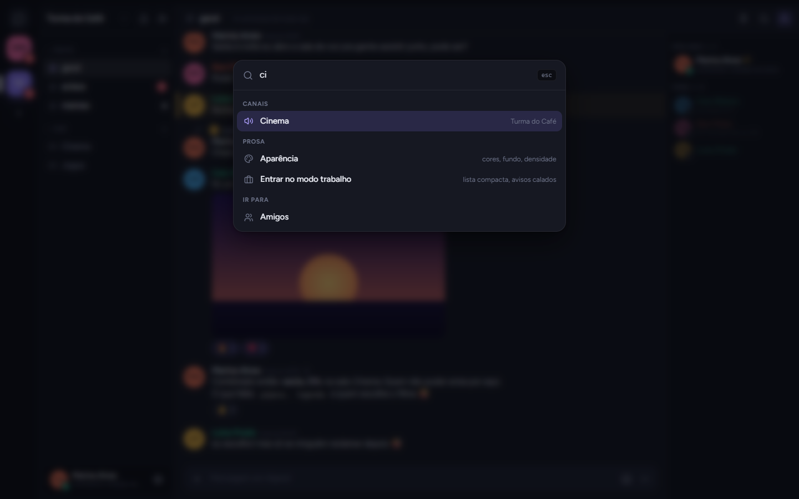
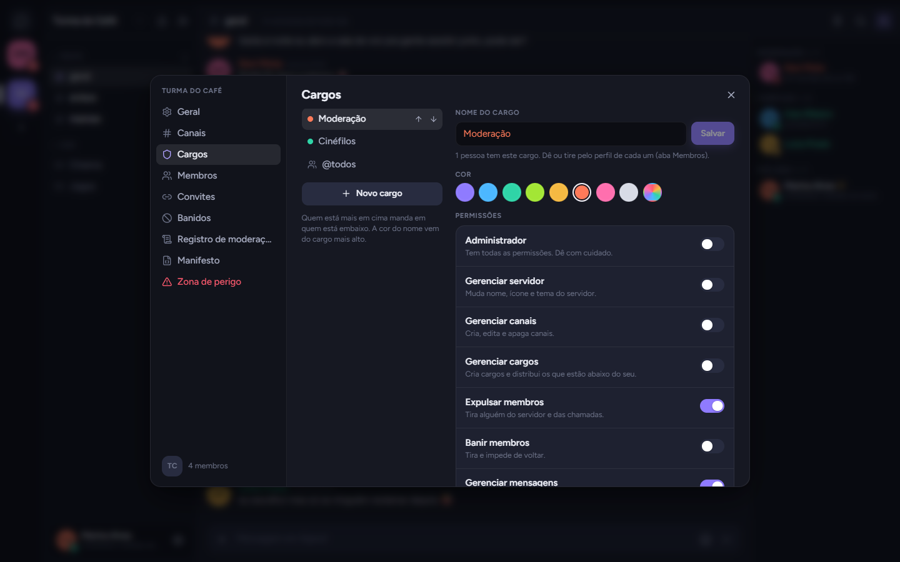
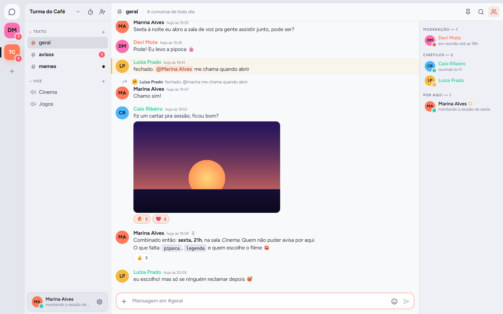
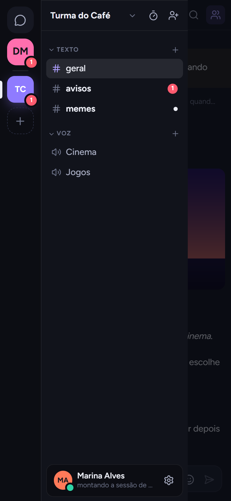
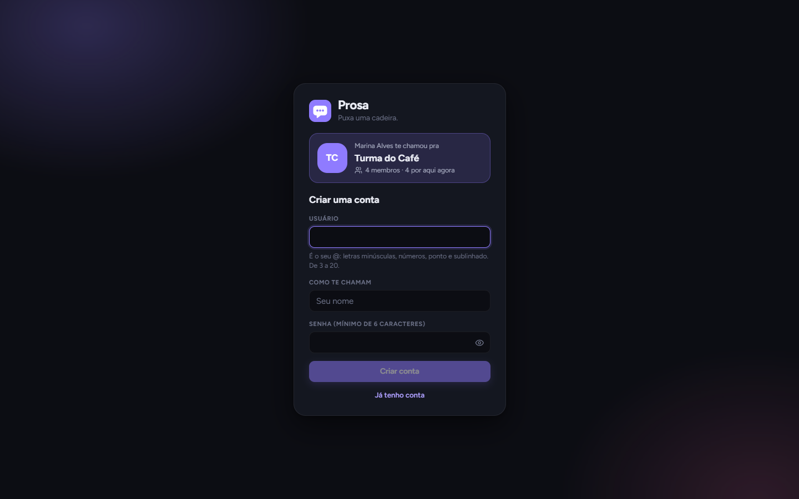
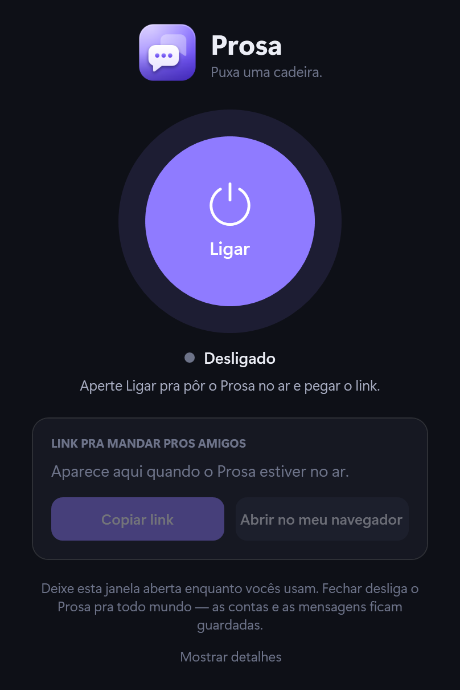
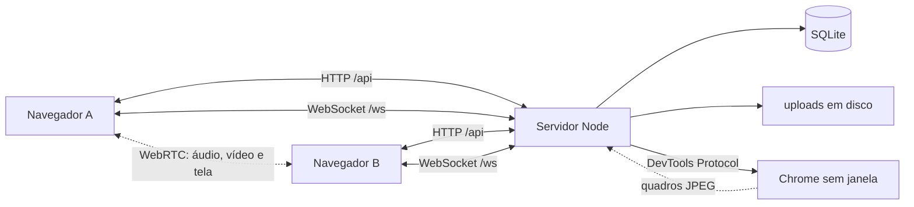

# Prosa

Um app de conversa para grupos de amigos: servidores com canais de texto e de voz, mensagens privadas, chamadas com vídeo e tela, e um navegador que todo mundo da sala vê e controla junto.

Roda inteiro num servidor Node só, com banco SQLite embutido e sem serviços externos. Dá para ligar no próprio PC com um clique e mandar o link para os amigos.



## Navegador compartilhado

Na sala de voz, quem tem permissão abre um navegador de verdade (um Chrome sem janela rodando no servidor) e a sala inteira vê a mesma página. Quem dirige é escolhido por canal:

- **Mãos juntas:** todo mundo mexe ao mesmo tempo, cada um com o cursor de uma cor.
- **Volante:** uma pessoa por vez, com fila para pedir a vez.
- **Só moderação:** só quem tem a permissão dirige.



## O que tem

**Conversa**
- Texto formatado (negrito, itálico, código, citação, spoiler), respostas, edição, reações e mensagens fixadas.
- Anexos de até 25 MB, arrastando ou colando, com visualização de imagem e prévia de link.
- Menções com `@usuario` e `@todos`, indicador de quem está digitando, contador de não lidas e a linha de "novas".
- Busca dentro do canal.

**Servidores**
- Seis modelos para começar, ícone, cor e fundo próprios, canais em categorias.
- Convites com validade e limite de usos, e adicionar um amigo direto, sem link.
- Cargos com cor e dez permissões, com hierarquia: só se age sobre quem está abaixo.
- Expulsar, banir, tirar alguém da chamada e um registro de moderação.
- **Manifesto:** a estrutura do servidor (canais, cargos, tema) em JSON, para guardar ou recriar outro igual.

**Voz e vídeo**
- Microfone, câmera e compartilhamento de tela com áudio, direto entre os participantes.
- Quem está falando, mão levantada, reações, volume por pessoa e escolha de aparelhos.
- Supressão de ruído e eco, apertar-pra-falar e atalhos de teclado configuráveis.

**Para o dia a dia**
- Amigos, pedidos de amizade e conversas privadas, com ligação direta.
- Sessão de foco: cronômetro e lista de tarefas compartilhados por servidor.
- Busca e comandos em `Ctrl+K`, avisos do sistema e sons.
- Seis fundos (um deles claro), cor de destaque, densidade, tamanho do texto e movimento reduzido.
- Funciona no celular e pode ser instalado como app (PWA).

<table>
  <tr>
    <td width="50%"></td>
    <td width="50%"></td>
  </tr>
  <tr>
    <td width="50%"></td>
    <td width="50%"></td>
  </tr>
</table>

<table>
  <tr>
    <td></td>
    <td></td>
    <td></td>
  </tr>
</table>

## Como rodar

Precisa do **Node 24 ou mais novo**: o servidor roda TypeScript direto e usa o SQLite que já vem no Node.

```bash
npm install
npm run dev
```

Abra http://localhost:5173. A API sobe na porta 3001 e reinicia a cada mudança; o front recarrega na hora.

Para rodar como em produção, com um processo só servindo o front já compilado:

```bash
npm run build
npm start        # http://localhost:3001
```

Os dados ficam na pasta `data/` (o banco `prosa.db` e os arquivos enviados em `data/uploads/`). Apagar a pasta zera tudo.

### Prosa.exe (Windows)

Para ligar sem abrir terminal, existe um pequeno programa com um botão de **Ligar**. Ele sobe o servidor, abre um túnel gratuito da Cloudflare e mostra o link para mandar aos amigos.



Ele não vem pronto no repositório; compile uma vez:

```powershell
powershell -ExecutionPolicy Bypass -File launcher\build.ps1 -Shortcut
```

Isso desenha o ícone, gera o `Prosa.exe` na raiz do projeto (usando o compilador de C# que já vem no Windows) e cria um atalho na Área de Trabalho. Ele precisa ficar dentro da pasta do projeto e depende do Node 24+ e do [cloudflared](https://developers.cloudflare.com/cloudflare-one/connections/connect-networks/downloads/) (`winget install Cloudflare.cloudflared`). Se algo não ligar, "Mostrar detalhes" na janela mostra o que o servidor e o túnel disseram; o mesmo texto fica em `data/launcher.log`.

O link do túnel gratuito **muda a cada vez que você liga**, então mande o novo a cada sessão. Os convites antigos deixam de valer, mas quem já entrou no servidor continua membro.

### Chamar os amigos

`localhost` só existe na sua máquina. Para outras pessoas entrarem, o Prosa precisa estar num endereço **HTTPS**: o navegador só libera microfone, câmera e tela em HTTPS. O caminho mais curto é um túnel:

```bash
npm run build && npm start
cloudflared tunnel --url http://localhost:3001
```

O túnel devolve um endereço `https://…` para mandar ao pessoal. Para deixar no ar de vez, hospede em qualquer lugar que rode Node 24, com um disco que não se apague para a pasta `data/`. Hospedagens que só executam funções curtas (como Vercel ou Netlify) não servem: o servidor precisa ficar ligado e guardar estado em memória.

## Configuração

Tudo por variáveis de ambiente, todas opcionais:

| Variável | Para quê | Padrão |
| --- | --- | --- |
| `PORT` | Porta do servidor | `3001` |
| `HOST` | Em que endereço escutar (`127.0.0.1` = só esta máquina) | todos |
| `DATA_DIR` | Onde ficam o banco e os uploads | `./data` |
| `ICE_SERVERS` | JSON com servidores STUN/TURN das chamadas | STUN públicos |
| `BROWSER_PATH` | Caminho do Chrome/Edge do navegador da sala | detecta sozinho |
| `PROSA_BROWSER` | `off` desliga o navegador da sala | ligado |
| `PROSA_BROWSER_MAX` | Quantos navegadores de sala ao mesmo tempo | `3` |

Sem um servidor **TURN**, a chamada não fecha quando alguém está atrás de uma rede muito fechada (algumas redes de empresa e de celular). Se acontecer, aponte `ICE_SERVERS` para um:

```
ICE_SERVERS=[{"urls":"turn:turn.exemplo.com:3478","username":"usuario","credential":"senha"}]
```

## Como funciona



- **Servidor sem framework.** HTTP, roteamento e validação são poucas centenas de linhas em `server/`; o banco é o `node:sqlite` do próprio Node e o único pacote de runtime do lado do servidor é o `ws`. Cada rota confere permissão e hierarquia no servidor, nunca no cliente.
- **Tempo real por um WebSocket só.** Mensagens, presença, "digitando", estado das chamadas e o navegador da sala passam pelo mesmo canal, que se refaz sozinho depois de uma queda e busca só o que perdeu.
- **Chamadas ponto a ponto.** O servidor não toca em mídia: só repassa a sinalização. Entre cada par de pessoas há duas conexões WebRTC de mão única (uma em cada sentido), em vez de uma só de mão dupla. Assim nunca há duas ofertas disputando a mesma conexão, o que causava ligações mudas em testes.
- **Navegador da sala.** O servidor abre um Chrome sem janela por canal, captura a tela com o Chrome DevTools Protocol, manda os quadros JPEG pelo WebSocket e repassa o mouse e o teclado de quem está dirigindo. Toda requisição que a página faz passa por um filtro que bloqueia endereços de rede interna.
- **Front em React** com Zustand, Vite e TypeScript. O que nem toda sessão usa (a sala de voz e os ajustes) é carregado só quando abre.

## Estrutura

```
server/       servidor Node (HTTP + WebSocket)
  index.ts      sobe tudo e serve os arquivos
  db.ts         esquema do SQLite
  http.ts       roteador e validação
  core.ts       formatos de saída, permissões e avisos em tempo real
  gateway.ts    WebSocket: presença, digitação, voz e sinalização WebRTC
  browser.ts    navegador da sala
  routes/       rotas REST por assunto
shared/       tipos e permissões usados pelos dois lados
src/          front em React
  store.ts      estado do app e eventos do WebSocket
  voice.ts      chamadas (WebRTC)
  components/   as telas
  styles/       CSS
launcher/     o Prosa.exe (C# e o desenho do ícone)
docs/         imagens do README
```

`npm run typecheck` confere os tipos do front e do servidor.

## Limites que vale conhecer

- **Chamadas em malha.** Cada pessoa envia o próprio vídeo para todas as outras, então o peso cresce rápido com o tamanho da sala. A sala fecha em 12 pessoas; os testes foram feitos com até 3.
- **O navegador da sala não tem som.** O Chrome entrega só a imagem. Para assistir algo com áudio, compartilhe a tela marcando o som da aba. Ele roda no servidor, usando a máquina e a conexão de quem hospeda; por isso só abre quem tem a permissão "Moderar o navegador".
- **Redefinir a senha não manda e-mail.** O link aparece no console do servidor, e quem hospeda repassa para a pessoa.
- **Atalhos e apertar-pra-falar** só funcionam com a aba do Prosa em foco, como em qualquer app de navegador.

## Licença

[MIT](LICENSE)
